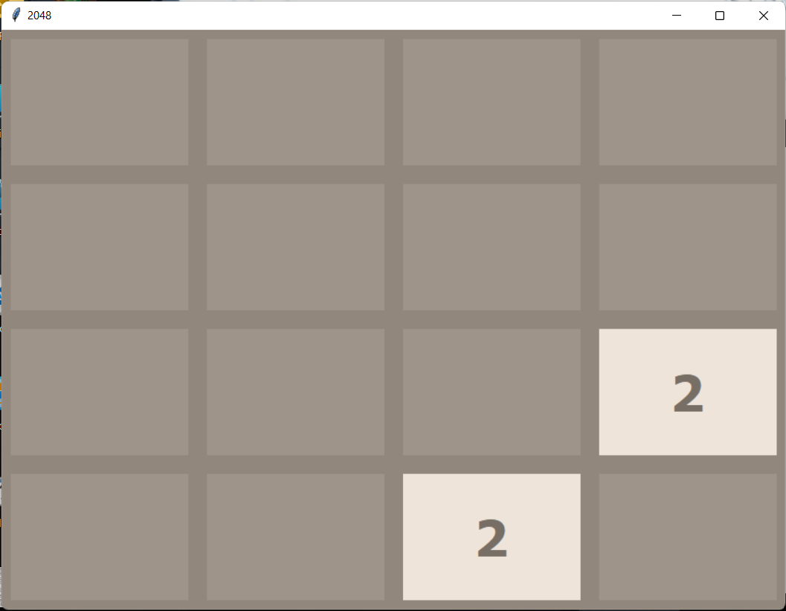

# 2048 Game

## About

It is the famous 2048 game, built using Python3 and tkinter library for UI of the game.

In case you don't know about the game, you can read about the game [here](https://2048-game.info/what-is-2048/).

To start the game execute the main file

```python
python main.py
```

## Controls

```python
W - Moving Up
S - Moving Down
A - Moving Right
D - Moving Left
```

## Screenshot



### Author: [Shubhang Gupta](https://github.com/jarvis-1805)
