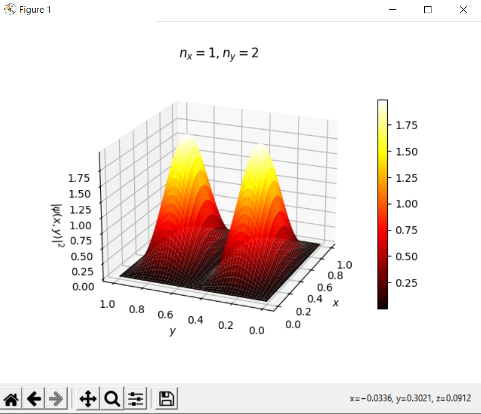

# Particle in a Box
Simulation of a Schrodinger equation's application 'particle in a box'

Graphs of probability density and wave functions for different parameters.

# Libraries used: 
- Numpy
- MatplotLib
- Math
