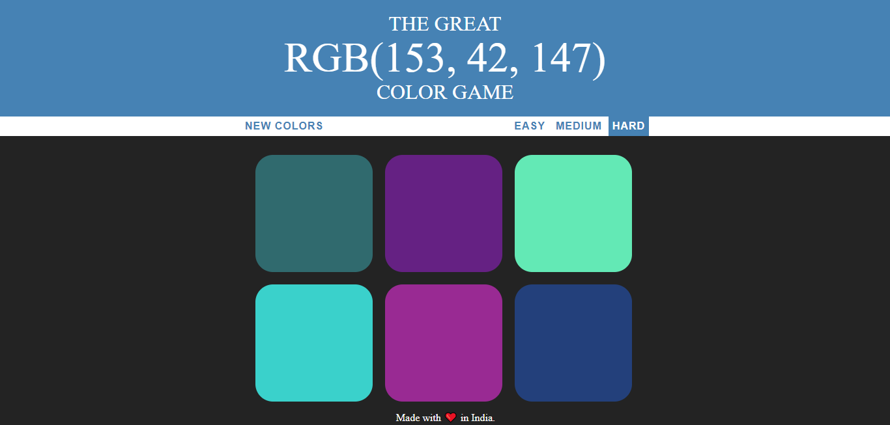

# RGB Color Game

It's not only a great RGB Color Guessing Game but it's also a really nice tool for you to practice RGB colors because the RGB color system is a little bit unintuitive at first. It's very different than most color systems that people are used to working with.Just making this project has helped me quite a bit to brush up on some of my RGB skills.
<br>
<b>How it works??</b>
<br>
When you load up the page, you get six random colors.These are always different.And one of those colors is listed in RGB.And your job is to pick which one.Remember that there are three channels red, green and blue and each one ranges from 0 to 255 and all that you need are those three colors to make every single color that you want.If you guess wrong it will go away and it will tell you to try again.Else all six squares come back.They all change to the correct color and the background appear changes to be the correct color as well.And you will get a message that says correct and if you want you can click on play again and that will generate new colors.And also you can do is change the difficulty.
<br>
<b>Just play. Have fun. Enjoy the game.</b>



## Getting Started

Start by cloning the repo : 
```sh
git clone https://github.com/dishantagg24/RGB-Color-Game
```
Or Download and extract the zip file.
### Prerequisites

* A modern-web browser like Brave , Chrome , Firefox etc
* Computer..
* At last, Just you and your will....


### Running

1. Double-Click on index.html file or Open it with your favourite browser.

## Built With

* [Javascript](https://www.javascript.com/) - High-level, interpreted programming language
* [HTML](https://www.html.com/) - Standard markup language
* [CSS](https://css.com) - Style sheet language

## Authors

* **[Dishant Aggarwal](https://github.com/dishantagg24)**

## License

This project is licensed under the MIT License - see the [LICENSE.md](https://github.com/dishantagg24/basic-simon-game/blob/master/LICENSE) file for details

## Acknowledgments

* https://www.udemy.com/course/the-web-developer-bootcamp/
