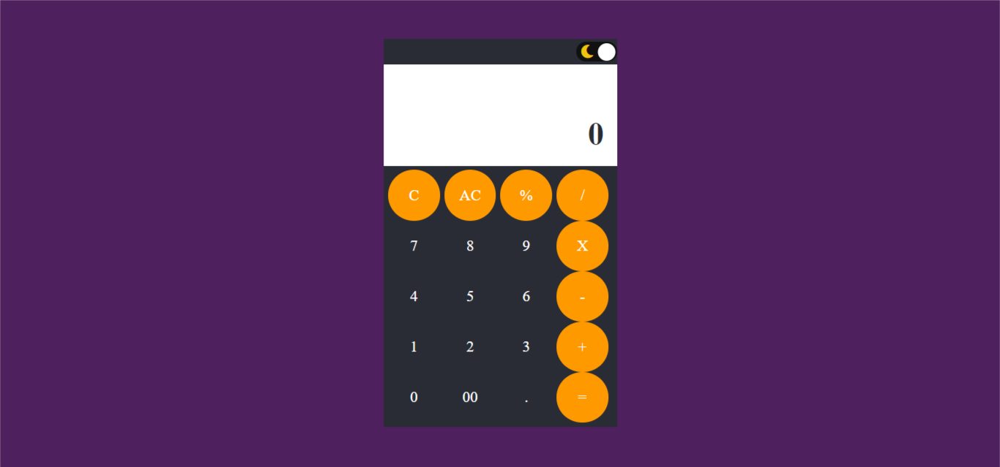

# CALCULATOR © 

**CALCULATOR** is a simple calculator website 💯 built to demonstrate use of *html, css, javascript & math.js library* made with ❤️. 

***You can see and test calculator from below 👇***

## About
A basic calculator.
- This makes it offline capable 😃. 
- Clean and Simple UI.
- It supports dark theme too 🌗.

