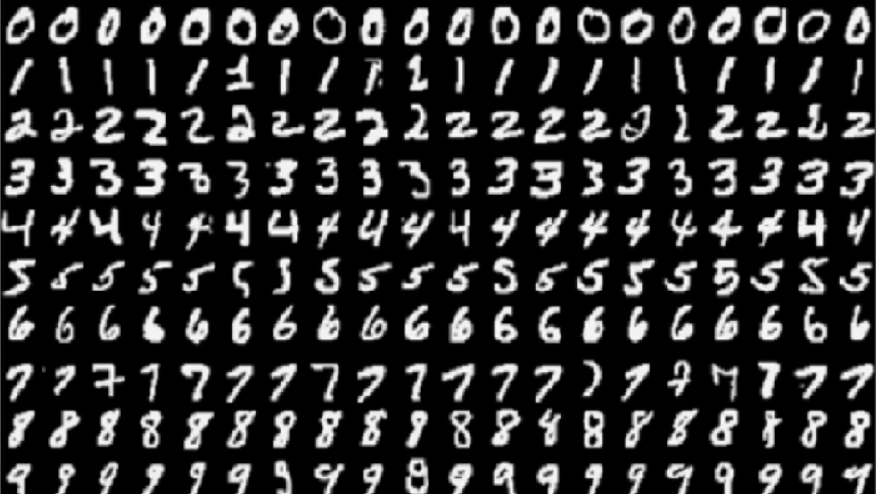

# Training a simple MNIST data set for detection of handwritten numbers in python using Pytorch

- download the mnist data set from -> https://deepai.org/dataset/mnist

# libraries used
- pytorch
- numpy
- torchvision
- tqdm
