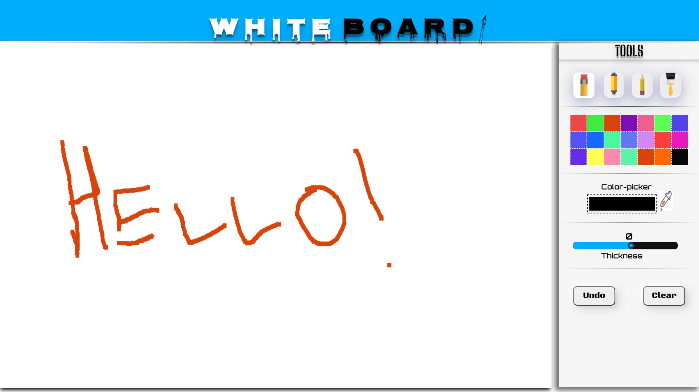

<h1 >WhiteBoard App using HTML,CSS & JAVASCRIPT</h1>

A project which aims to clone WhiteBoard App with responsiveness by using HTML, CSS & Javascript. 

 

<h2 id="tech-stack-used">Tech Stack Used</h2>
 

<h2 id="how-to-use">How to use:</h2>
 

<ul>
  <li>Download or clone the repository</li>
<pre><code>
  git clone https://github.com/deadpool-developer/Whiteboard-App
</code></pre>
  
  <li>Go to the directory</li>
  <li>Run the white.html file in your browser</li>
  <li>Start creating around the page </li>
</ul>

<h2 id="use-of-the-project">Use of the Project</h2>

By making this project, your skills will be enhanced and specially for CSS. This single project uses Flexbox, CSS Grid, Media Queries, etc. These are consider one of the most important concepts of CSS and these skills will be better after making this mini project. The main concepts of javascript is used which also include Canvas 3D.

  

