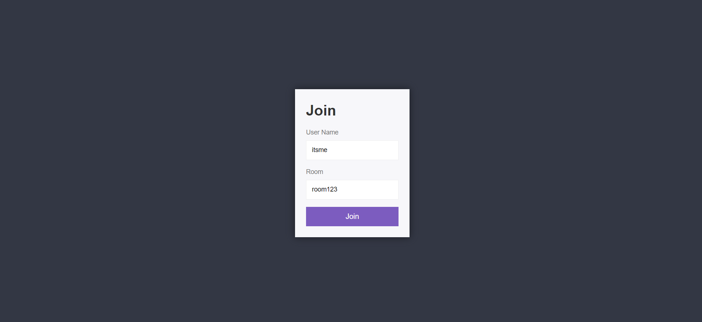
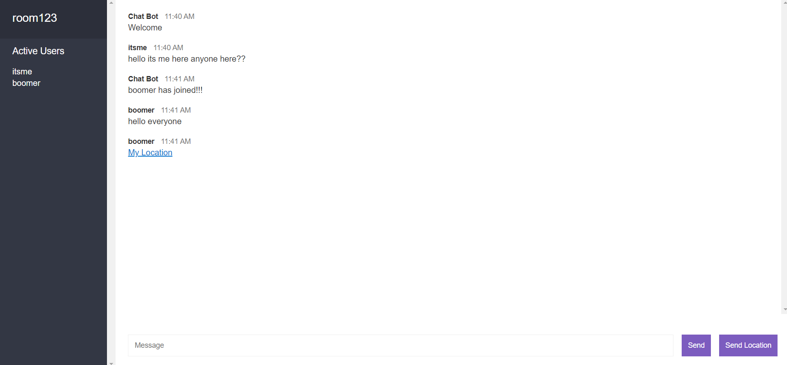

A basic chat application made using socket.io

Users can create new room and join a chat

Users can see the list of active users in the current room

User can also share their live location in the chats

Tech Stack Used - HTML, CSS, Javascript, Node.js, Express, Socket.io

**Screenshots of the web app-**

