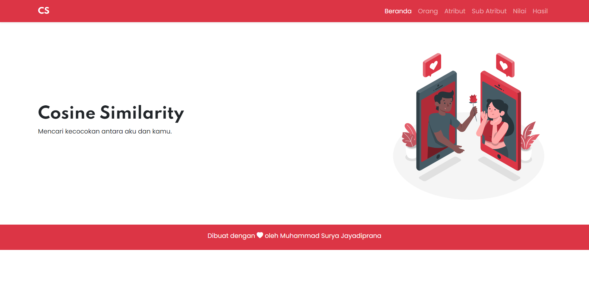

 
  

  &#xa0;

  <a href="https://cosine-similarity.suryamsj.my.id/">Demo</a>

<h1 align="center">Mencari Kecocokan Antara Aku dan Dia Menggunakan Metode Cosine Similarity</h1>

  

  

  

  

  

  <a href="#dart-about">About</a> &#xa0; | &#xa0; 
  <a href="#rocket-technologies">Technologies</a> &#xa0; | &#xa0;
  <a href="#memo-license">License</a> &#xa0; | &#xa0;
  <a href="https://github.com/suryamsj" target="_blank">Author</a>

 

## :dart: About ##

Cosine Similarity adalah metode untuk mengukur kemiripan antara 
dua dokumen atau teks. Pada Cosine Similarity dokumen atau 
teks dianggap sebagai vector. Pada kasus kali ini adalah mencari kecocokan antara aku dan kamu.

Untuk atribut yang digunakan :
- Hobi = {membaca, menulis, ngegame}
- Sifat = {romantis, humoris}
- Makanan = {sate, martabak}
- Minuman = {teh, kopi}
- Genre film = {action, comedy, romance}
- Film = {hollywood, bollywood, anime, k-drama}
- Musik = {inggris, indonesia, jepang, kpop}

## :rocket: Technologies ##

Teknologi yang digunakan pada project ini:

- [XAMPP](https://www.apachefriends.org/index.html)
- [PHP](https://www.php.net/)
- [Mysql](https://www.mysql.com/)
- [Bootstrap 5](https://getbootstrap.com/)
- [SweetAlert2](https://sweetalert2.github.io/)
- [Vanilla-DataTables](https://github.com/Mobius1/Vanilla-DataTables)
- [Storyset](https://storyset.com/)

## :memo: License ##

Project ini berada dibawah lisensi MIT. Untuk lebih detailnya, silahkan cek file [LICENSE](LICENSE).

Dibuat dengan :heart: oleh <a href="https://github.com/suryamsj" target="_blank">Muhammad Surya Jayadiprana</a>

&#xa0;

<a href="#top">Kembali ke atas</a>
