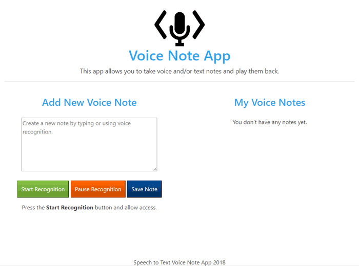

## Voice Note App
### Converting from Speech to Text with JavaScript

The purpose of this app is to experiment with the Web Speech API which enables you to incorporate voice data into web apps. The Web Speech API has two parts: SpeechSynthesis (Text-to-Speech), and SpeechRecognition (Asynchronous Speech Recognition.)

This app uses the Web Speech API to build a voice powered note app to do 3 things:

 - Takes notes by using voice-to-text or keyboard input.
 - Save voice notes to localStorage.
 - Display all of the saved notes and give the option to either Listen to the Notes or delete them.



<br>

__Project Status - Completed: 05/31/2018__

[Demo - Click Here](https://www.dkmitt.com/mycoding/voice-note-app/index.html) - __Best Used with Chrome__

__Note:__ On Chrome, using Speech Recognition on a web page involves a server-based recognition engine. Your audio is sent to a web service for recognition processing, so it won't work offline.
<br>

Most APIs that require user permission don't work on non-secure hosts. Make sure you are serving your Web Speech apps over HTTPS.
<br>

----

### Table of Contents

  -  Description
  -  What I Learned From The Exercise
  -  Website Technologies Used
  -  How to Use This App
  -  File and Directory Structure
  -  Resources
  -  Revision History  
<br>

----


### Description

The Web Speech API provides two distinct areas of functionality — speech recognition, and speech synthesis (also know as text to speech, or tts) 

The Voice Note App will be separated into two seperate interfaces. The first will be the __"Speech Recognition"__ that will involve receiving speech through a device's microphone, which is then checked by a speech recognition service against a list of grammar (basically, the vocabulary you want to have recognised in a particular app.) When a word or phrase is successfully recognised, it is returned as a result (or list of results) as a text string, and further actions can be initiated as a result.

The second is __"Speech Synthesis"__ (aka text-to-speech, or tts) that involves receiving synthesising text contained within an app to speech, and playing it out of a device's speaker or audio output connection.
<br>


----


### What I Learned From The Exercise
- To work with the Web Speech API; speech recognition, and speech synthesis.
<br>

----


### Website Technologies Used

Description of website technologies used to develop this app.

- HTML
- CSS
- JavaScript
- Bootstrap
- Web Speech API
<br>

----


### How to Use This App

### Add A New Voice or Text Note
1. ​Click on the Start Recognition Button and give the app permission to use your microphone, and start speaking your note (if no microphone or you don't want to use the microphone you can type into the text box.)

2. ​When done speaking click on the "Pause Recognition" button, and then click the "Save Note" button. (if you you typed your note in to the text box you do not need to click on the "Pause Recognition" button, just click the "Save Note" button.) 
<br>

----

### Listen To Notes
1. Click on the "Listen to Note" link next to the date of the note that you want to listen to.
<br>

----

### Delete Voice Notes
1. Click on the "Delete" link next to the date of the note that you want to delete.
<br>

----


[Demo - Click Here](https://www.dkmitt.com/mycoding/voice-note-app/index.html) - __Best Used with Chrome__

__Note:__ On Chrome, using Speech Recognition on a web page involves a server-based recognition engine. Your audio is sent to a web service for recognition processing, so it won't work offline.
<br>

Most APIs that require user permission don't work on non-secure hosts. Make sure you are serving your Web Speech apps over HTTPS.
<br>


----

### File and Directory Structure

```
.
├── assets
│   │
│   ├── css
│   │   │
│   │   └── style.css
│   │
│   ├── ico
│   │   │
│   │   └── favicon.ico
│   │
│   ├── img
│   │   │
│   │   ├── code-mic-150.png
│   │   │
│   │   └── vna-1.gif
│   │
│   └── js
│       │
│       └── script.js
│ 
├── .gitignore
│
├── index.html
│
└── README.md     
       
```

----


### Resources

Article from [tutorialzine Converting from Speech to Text with JavaScript](https://tutorialzine.com/2017/08/converting-from-speech-to-text-with-javascript) using HTML, CSS, [jQuery](https://jquery.com/), JavaScript, and [Shoelace.css](https://shoelace.style/index.html) a lightweight, forward-thinking CSS library built with future CSS syntax.
 
Reference how to work with the Web Speech API - [MDN Web Docs Web Speech API](https://developer.mozilla.org/en-US/docs/Web/API/Web_Speech_API)
<br>

----

### Revision History 

Description of revisions - __Completed: 05/31/2018__

  - [x] Dev - file and directory structure updated - 05/30/2018
  - [x] Dev - starting code - 04/06/2018
  - [x] Dev - styling update - 05/30/2018
  - [x] Dev - completed code - 05/30/2018
  - [x] Dev - readme update - 06/01/2018